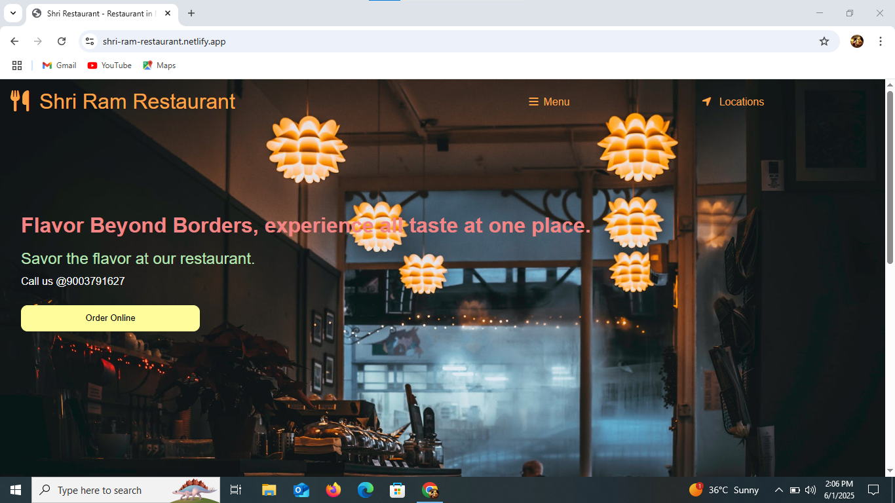
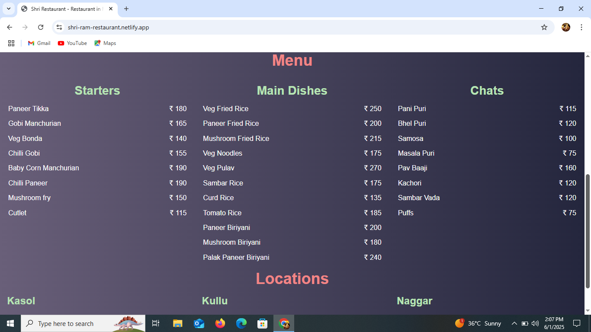

# 🍽️ Shri Ram Restaurant Website

Welcome to the **Shri Ram Restaurant** official website — an elegant, responsive, and user-friendly site built using **HTML**, **CSS**, and **JavaScript**.

🔗 **Live Demo**: [Click Here to Visit](https://shri-ram-restaurant.netlify.app/)

## 👩‍💻 Developed By
**Gayathri G**  
GitHub: [GAYATHRI1006](https://github.com/GAYATHRI1006)

---

## 📸 Project Preview

### 🖼️ Home Page


### 🖼️ Menu Section


---

## 📝 Features

- 🌐 Fully responsive design
- 🍲 Beautifully categorized menu (Starters, Main Dishes, Chats)
- 📍 Location section for customers to find nearby branches
- 📞 Contact number to place orders
- 🟡 Attractive "Order Online" button

---

## 🛠️ Tech Stack

- HTML5
- CSS3
- JavaScript
- Netlify (for deployment)

---

## 🚀 How to Run Locally

1. Clone the repository  
   ```bash
   git clone https://github.com/GAYATHRI1006/shri-ram-restaurant.git
